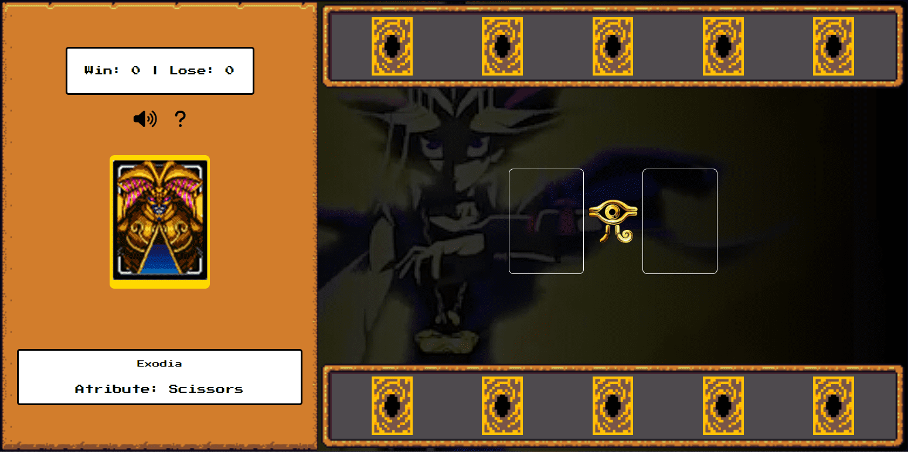

<h1 align="center">js-yugioh-game</h1>

## 📲 View the project here
<a href="https://devgustavus.github.io/js-yugioh-game/">https://devgustavus.github.io/js-yugioh-game/</a>

## 📖 About the project
Project developed as part of a coding/project challenge at DIO, as part of the BootCamp: "Potência Tech iFood - Game Development." The project is based on the Yu-Gi-Oh! universe and involves a card game. However, the game's rules are defined similar to a paper, rock, and scissors game, along with various other interactive elements that enhance the user experience. The project includes a tutorial button and window to explain how the game works, as well as a button to mute and unmute the background music.

### Menu


## 🦾 Technologies used
<div style="display: flex;">
  


</div>

## 🤔 What i learned
- I learned how to build small game engines.
- I learned to standardize functions according to the game engine.
- I improved user interaction with web elements.
- I enhanced the dynamism of the web page as the project is centered around a game.

## 👽 How to clone this project

````bash
    # Select where you want to clone
    $ cd ~/Documents/WHERE_YOU_WANT
````

````bash
    # Clone the project
    $ git clone https://github.com/DevGustavus/REPOSITORY_NAME.git
````

````bash
    # Check if cloning worked fine
    $ cd ~/Documents/DIRECTORY_LOCATION
    $ ls
````
